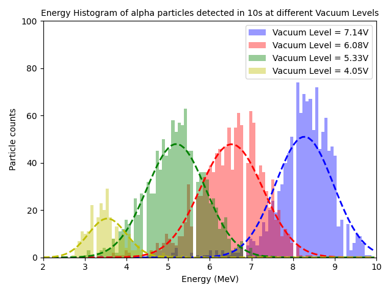
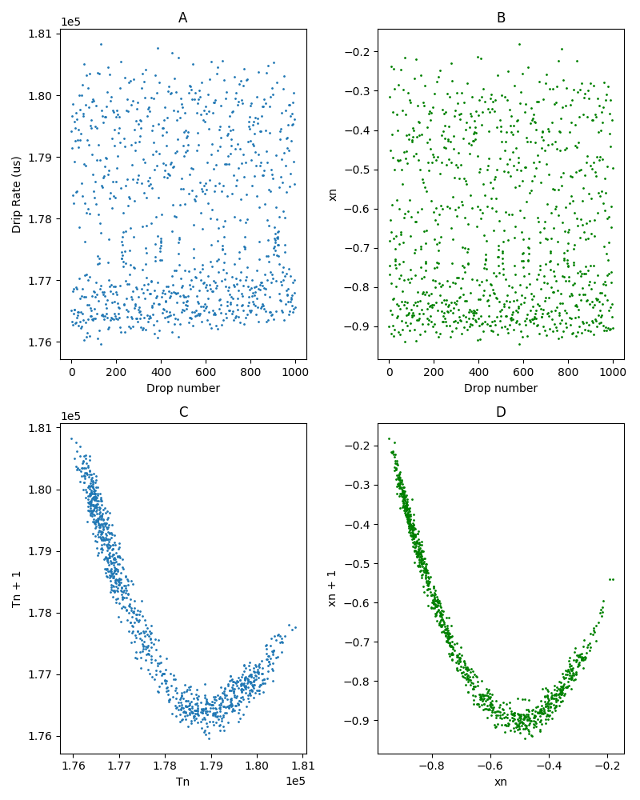
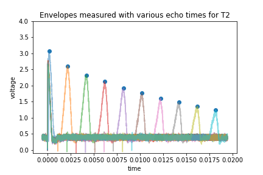

# Experimental Physics

## Fascinating experiments in Physics! 

### [Measuring the propagation distance of α particles in air!](alpha)

### [Observations of Chaotic Rhythms of a dripping faucet!](chaos)

### [Discovering the pulsed magnetic resonance in particle spins!](pNMR)

