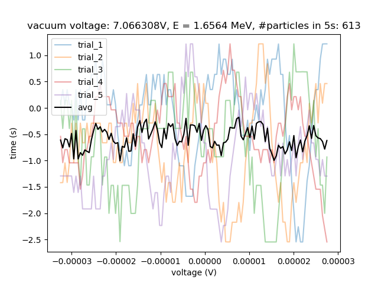
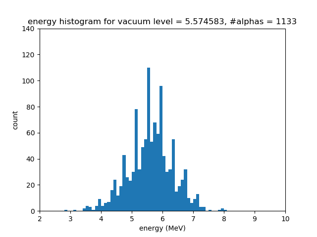

# Lab 1 Alpha

### Particle energy distributions plotted at the end:


#### *Note: had trouble seeing the latex equations on GitHub, would recommend cloning the repo to view locally*

## Preliminary thoughts:
After doing the prelab and going through the lab readings, the experiment is to try and quatify the energy loss of alpha particles through a barrier. By changing increasing pressure in the chamber from vacuum to atmosphere, this effectively acts as changing the depth of the barrier. 

Experiment: measure the voltage while changing the vacuum of the aparatus, this can give us some information about how much energy the alpha particles are losing in air

## Measuring volage
### notes:
- using python threw an error, this was fixed when running the script with python3 instead
- tested out ScopeTraceCapture.py, after running grabbed data for time and voltage

Performed some code refactorization, copied all the scripts from /usr/local/bin into /scripts and made modifications to the code to allow for easiers calls to them in my custom scripts. Created a lot of custom functions to replace the functionality of the scripts to allow for better control of the apparatus for data collection. Refer to the code files under scripts/ to view all modifications to exisiting code. 


Some debugging
---

The roomvalve appeared to be working properly, but the vacuum valve was not. This was solved when we swapped out the relay connecting the two valves from the raspberry pi. This enabled the full remote measurement system to work.  

Trying to figure out how to set the oscilloscope


Q: why is the voltage that is captured on the trace different from the one on the oscilloscope?

A: in ScopeTraceCapture.py, uncommented the normalization for data: which fixed the problem


now we are able to get the data for all voltage values, and obtian a trace that is identical in scale to the one displayed on the scope

Q: the measurement is showing when an alpha particle contacts the measurement surface, so why is there a negative peak as well as a positive peak?

A: that is just how the sensor triggers the measurement, so the energy of the particle that hits the scope is the peak to peak voltage


## Energy of the Alpha particle

To get the energy of the alpha particle, we must convert the measurement from the oscilloscope into electron volts. 

To convert to electron volts, use the equation $E = V 
cdot e$ where e is the elementary charge of an electron. For alpha particles this is 2, so we can get the energy of the alpha particle by multiplying the peak to peak voltage by 2. 


# Experiment 1

After preliminary explorations, the following experiment was devised:

1. start at vaccuum pressure,
2. take measurement of current chamber pressure
3. take measurement of alpha particle energy, (over 5 measurements, and average)
4. count how many particles hit in 5 seconds
5. lower the pressure
6. repeat steps 2-5 until enough data is obtained
7. plot pressure voltage vs particle count
8. plot pressure voltage vs particle energy
9. save pressure voltage array, counts array, and energy array

The motivation for this experiment was to try and capture the scope trace for a whole collection of particles at varying vacuum voltages to examine the relationships. 

## Particle Energy Measurement

Performed this for 5 measurements at vacuum voltage of 4.8672. Then the average energy of the particles could be determined by differencing the highest and lowest voltages captured by the scope


- However, this method was very slow, and the scope kept throwing an error when performing the data collection (sometimes the full trace on the scope would not be captured) and the scope would give a measurement such as the following:



The problem with this is when the scope tries to capture the trace from the oscilloscope, only the first chunk of the data is properly read, and the data collection errors out afterward. 

> This issue should be investigated and may be a bug with the software package to interface with the oscilloscope


## Particle counts 

Using [scripts/TriggerPulseDetection.py](scripts/TriggerPulseDetection.py)

Customized the script to read the number of triggers that are detected by the oscilloscope in x seconds. The oscilloscope was set to trigger on rising edge.

Ran a variation of main.py to plot the number of triggers detected in 5s across various vacuum voltages:


 
Made some preliminary measurements for particle energy at various voltages: However the scope errored out before the whole procedure was completed, but the energy distributino gaussian curve is observed to shift to the left as the voltage decreased.


## Saving data
The data for every experiment was logged and saved as .npy files. Utilized a method for timestamping each recorded plot and measurement so that every time an experiment is run, it will be saved with a unique date-time tag. All data can be found under [/data](/data), but many of the unnessecary files from trial runs have been removed. 

## Notes on Experiment 1
This experiment gave a good fist look at the problem of determining the energy distributions of alpha particles, and it could be seen that the energy curve begins to shift to the left as the pressure is increased (path length increased). However to make more accurate measurements, a larger number of points need to be measured. A prelliminary thought is that at least 1000 particles should be measured at each vacuum level to ensure a more accurate distribution of the particle energies. 
More details will be included in experiment 2:

# Experiment 2
Objective: try to obtain a Bragg curve for the alpha particles and also analyze the distribution of particle energies at each vacuum level.
1. Measure the number of particles that hit the sensor in 10s, and also their energies, for a range of voltages between 3V (room pressure) and 7.1V (vacuum pressure)
2. Find the dE/dD (energy loss per cm) for each of those points
3. Plot dE/dD vs distance to obtain bragg curve
4. For each pressure, plot the distribution of the particle energies
5. Analyze how the energy distribution changes over different pressures (expect a gaussian whose tail grows, as in the prelab)

Motivation: After analyzing what was learned from experiment 1, experiment 2 seeks to obtain more accurate measurements of the distribution of energies for alpha particles. The problem is to try and measure the energies of the particles in a faster manner, and to also try and replicated the Bragg curve of alpha particles. 

## Conversion of Voltage to Pressure 
Before starting the experiment, want to get a more accurate understanding of the relationship of the vacuum level how long the roomvalve is opened for. This is so that we would be able to better control the voltage of the chamber to get measurements at specific points. 
Wrote a script [vaccum_level_vs_time.py](vaccum_level_vs_time.py), and utilizing it, the roomvalve is opened for 1 second increments. The vacuum voltage is plotted vs time that the room valve is opened. The results are shown here:


From this, we assume a roughly linear relationship between the time which the valve is opened and the pressure of the container.

 
After opening the room valve for a long time, the measured voltage at room pressure is ~1.15V. After sucking out the air for a long time, the voltage measured is ~7.17V. 
The chamber is at vacuum = 0 atm at the reading of 7.17V
The chamber is at room pressure = 1 atm at the reading of 1.15V

We can therefore derive the following equation for pressure (P), in terms of the voltage measured by the multimeter (V):
$$P = \frac{7.17-V}{6.02}$$

Then we can use the given equation 
$$d = \frac{P}{P_{atm}} d_0$$
to find that that, for $d_0 = 4.5 \ cm$
$$d = \frac{7.17-V}{6.02} \cdot 4.5 \ cm$$

## Trigger Level for Oscilloscope
First open the room valve for a very long time, so that the vacuum voltage in the chamber is around 1.2V. By looking at the readings on the oscilloscope and manually adjusting the trigger level, the noise of the sensor cannot be detected when the trigger above below ~400 mV. Therefore, **choose a trigger level of 500mV** when taking measurements to ensure we are only triggering for alpha particles and not background noise. 

> *Through this analysis, realized that the previous plot is not correct as the trigger level was set a little too high*

Replotted particle counts vs vacuum voltage, triggering for 1s at each range from 1.2 to 7.1 volts:


From this plot, it can be determined that the alpha particles are no longer detected after the voltage drops to below ~3V. This corresponds to a distance of approximately $$d = \frac{7.17-3}{6.02} \cdot 4.5 \ cm = 3.1 \ cm $$

From this graph, we can also determine that the transition point for greatest energy loss is from 3.5 - 5.5V. Next we will measure the voltage of the apparatus as a function of time which the valve has been opened to determine the amount of time needed to open the valave to achieve a desired voltage. 

## Energy Measurement

In order to speed up the measurement of particle energies, modified ReadScopeVoltage.py to probe only the max and min voltages on the oscilloscope. Then, the particle energy can be determined as $E = 2 \cdot (V_{max} - V_{min})$ (measured in eV). Will attempt to take ~1000 measurements at each vacuum level to give a better measurement of the distribution of particle energies.

Getting this Braggs curve from wikipedia: 


To replicate this curve, roughly need the derivative at ~10 points. The first thoughts are to make pairs of measurements at various voltage values so that the difference can be calculated to obtain the derivative value at those levels. From the previous plot of counts, it makes sense to make more measurements at where the change in energy is steper. As such, propose to take pairs of measurements around vacuum levels of
7.1, 6.5, 6, 5.5, 5.25, 5, 4.75, 4.5, 4.25, 4, 3.75, 3.5, 3

## Accurately setting vacuum voltages
To ensure the chamber can be accurately set to specific voltages, use the data obtained from plotting voltage vs time before to interpolate the time needed to open the valve to achieve the next voltage value.

$$t_{0} = \frac{V_{0_h} - V_0}{V_{0_h} - V_{0_l}} \cdot 1 + t_{0_l}$$
$$t_{f} = \frac{V_{f_h} - V_f}{V_{f_h} - V_{f_l}} \cdot 1 + t_{f_l}$$

where $V_0$ is the current voltage, $V_f$ is the target voltage, $t_0$ and $t_f$ are interpolated times on the graph, $V_{*_h}$ is the next highest voltage data point from $V_*$ and $V_{*_l}$ is the next lowest voltage data point from $V_*$ 

The time needed to open the room valve to achieve $V_f$ from $V_0$ is then $$t=t_f - t_0$$

This is coded in [scripts/getValveTime.py](scripts/getValveTime.py)

Before deploying, check that this is code works by trying to measure the specifc list of voltages: 
[7.15, 7.05, 6.55, 6.45, 5.55, 5.45, 5.3, 5.2, 5.05, 4.95, 4.8, 4.7, 4.55, 4.45, 4.3, 4.2, 4.05, 3.95, 3.8, 3.7, 3.55, 3.45, 3.05, 2.95]

The script [test_valvetime.py](test_valvetime.py) is run, with the target and actual voltages plotted here:


This is quite satisfactory, and will now proceed to performing the experiment

## Starting the the experiment

From the list of voltage levels measurements will be taken at +/- 0.05 of the target voltage. Then the energy loss per cm will be approximated from each pair.

The procedure will be: for each voltage V 
1. measure at V + 0.05V
2. get the number of particle counts in 10s, $N_i$
3. measure energies of $N_i$ particles
4. repeat 2,3 at vacuum level V - 0.05V

This is done in [energy_differencing.py](energy_differencing.py)

## Saving data

The results for each pair of measurements are saved to .json files for easy retreival

The json format is 
```
{
    "1": {
        "vacuum_level": lower_vacuum_level,
        "trigger_time": time_in_seconds,
        "particle_counts": number_of_particles_detected,
        "particle_energies": list_of_particle_energies
    },
    "2": {
        "vacuum_level": lower_vacuum_level,
        "trigger_time": time_in_seconds,
        "particle_counts": number_of_particles_detected,
        "particle_energies": list_of_particle_energies
    }
}

```

taken for each energy level

For example, look at [example measurement .json file](data/10-12-00-49-33-V=7_10.json)

## Braggs curve

Using
[braggs.py](braggs.py)
the results are plotted

To get the average energy loss per particle at each step, use the formula:

$$E = \frac{E_{f} - E_{0}}{d_{f}-d_{0}} \cdot \frac{1}{N_0}$$

where $E_f$ is the final total energy of the particle distibution, $E_0$ is the inital total energy of the particle distribution, $d_f$ is the final path lenghth $d_i$ is the initial path length, and $N_0$ is the initial particle count

$E_f$ and $E_0$ can be determined by integrating the curve of particle distibutions at the initial and final voltages. This roughly resembles the shape of a Braggs curve. However, the energy loss near the peak of the curve is a little higher than the expected value. 
Taking a look at the 

The results is plotted below:


This plot roughly resembles the shape of the expected Bragg curve, but contains a few outlier points. Additionally the scale of the voltage values seem a little high especially at the peak of the curve. However, due to time constraints, was unable to re-do the experiment with more accurate data collection (see notes at end of report)

## Curve fitting Braggs curve

Attemped to curve fit the curve using various polynomial degrees:


However, non of these curves fit the data very well, which mean the relationship of the curve might not neccessarily be a degree n polynomial. Also this may be due to the fact that the data points are very sparse and there appear to be outliers. 

Other curve fitting methods should be attempted but also with more accurate data. 

# Energy distributions

The GIF show the evolution of particle energy distributions plotted for the number of particles detected at the detector in 10s, as the pressure is increased from vacuum to room pressure. 

GIF was made using  [make_gif.py](make_gif.py)


 
 

 
 

 
 

 
 

 
 

 
 

 
 

 
 

 
 

 
 

 
 

 
 

 
 


## Initial energy of alpha particles
The initial energy of the alpha particles can be determined by looking at the mean of the distribution at the highest vacuum voltage (0 atm pressure). Calulating the mean of this distribution gives a value of of 8.27 MeV. [calculate_alpha_energy.py](calculate_alpha_energy.py)

## Path length of alpha particles in air

From the above plots, the minimum vacuum level for which no more particles are detected by the sensor is at a vacuum voltage of around 3.059V. From the relationshiop of distance to voltage, $$d = \frac{7.17-V}{6.02} \cdot 4.5 \ cm$$
this corresponds to a path length in air of $d = \frac{7.17-3.05}{6.02} \cdot 4.5 \ cm = 3.07cm$

More precise measurements should be done, measuring the triggers at finer level around this voltage to determine a more precise value for the path length. 


# Conclusion

From this experiment, the energy loss of alpha particles through air was examined. The resulting distribution of alpha particle energies was plotted. The distribution was as expected, with an initial gaussian distribution of particle energies. As the path lenght increased, a longer tail formed on the distribution, and the overall mean shifted left, indicating that a portion of the particles were losing energy. The overall number of particles also decreased as some lost enough energy to fully stop before hitting the sensor. 

## Remarks

Given more time to take measurement, finer increments should be done for iterating through the voltage levels. A reason for the discrepancy of the bragg curve from the expected curve may be due to the fact that the differencing voltage pairs had too large of a difference between them (for example the difference in particle counts for the first and second measurements for [data/10-12-00-49-33-V=4_00.json](data/10-12-00-49-33-V=4_00.json) was 250 - 153 = 97, which accounted for a more than 37% change. Attempting to calcuate the derivative from such a large jump in data would have resulted in a not very accurate calculation, which can help explain the abnormally high values observed on the bragg curve. It would also improve precision if more data points could be collected with a longer trigger time, maybe 10000 or 100000 particles. 

If repeating this experiment, a proposal would be to perform the same procedure, but with 0.1V increment gaps between voltage measurements, and a +/- 0.001 between pairs for calcuation of the derivative. Such a procedure would likely yield a better and more accurate Bragg curve. 

Measurements made for the experiement were fairly accurate. The code base made the entire procedure very repeatable, and repeated attempts should be made to ensure the reliability of the experiment. However, many approximations were made, such as the equation for path length, which may have affected the overall accuracy of the measurements. 

A major blocker to the experiment was from the fact that it was very time consuming to take measurements of particle voltages on the oscilloscope (approximately one second per measurement). If this was able to be sped up, then data collection would be massively easier and a more precise analysis could be made. It would also be greatly beneficial if there were ways to program the oscillocope to record the Vmax and Vmin for every single time it triggers, and to record a large number of these measurments in very little time. 

The time contraint also arose due to the fact that technical difficulties were experienced during the first lab session when the relays for the measurement devices were faulty, and extra time was taken to resolve those issues (by swapping out the relays). 

Other blockers came from the random shutdown of devices while trying to collect data remotely, often terminating the expriment before the full set of data could be collected. More modifications can be made to the code base to allow for the ease to resume some of these failed trials. 