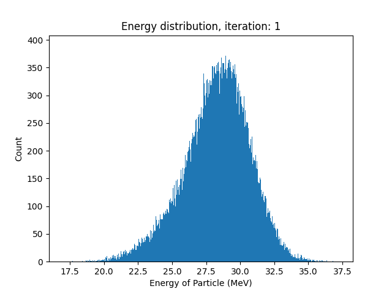
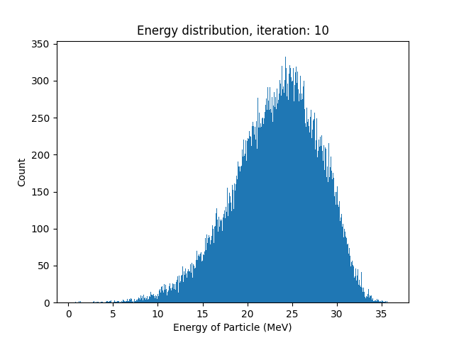

# Lab 1 - Alpha Particles

## Prelab
---
refer to [PreLab PDF](docs/prelabs.pdf)

### Simulating passage of a-particle through thin layer of air
Using [python script](prelab.py), generated a histogram of 100000 particles centered around 28.8 MeV with a standard deviation of 2MeV.

    

### modeling N passages in python
arbitrarily selected dE = 8MeV and F = dE/E0 = 0.278, and 10 passings  

    
     
    
     
    
     
    
     
    
     
    
     
    
     
    
     
    
     
    

changed dE to 4MeV, F = dE/E0 = 0.139, for 10 passings

    
     
    
     
    
     
    
     
    
     
    
     
    
     
    
     
    
     
    

dE=5, 20 iterations

 
 
 
 
 
 
 
 
 
 
 
 
 
 
 
 
 
 