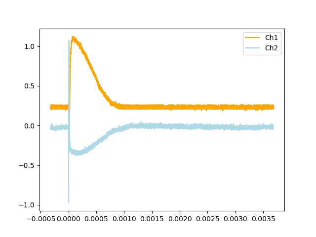
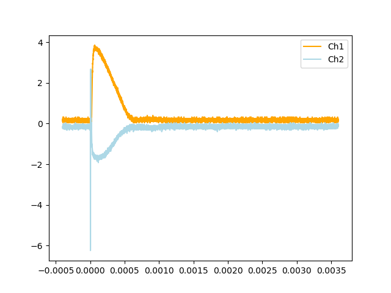
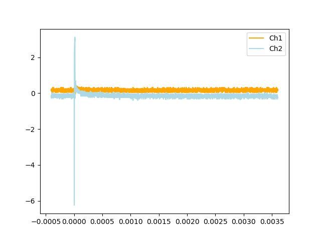
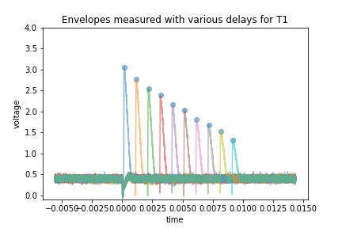
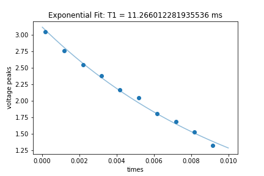
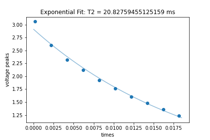
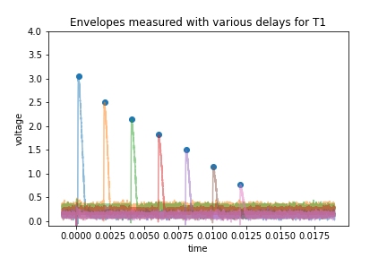
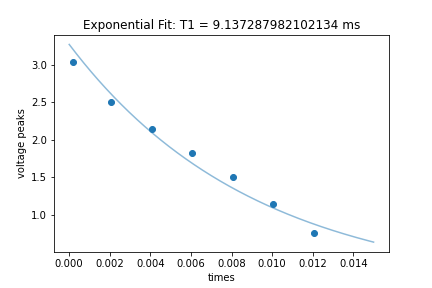
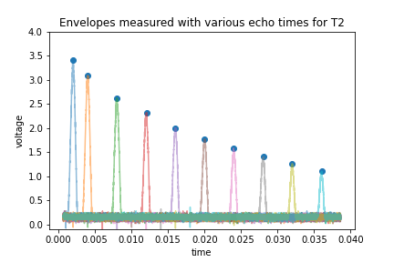
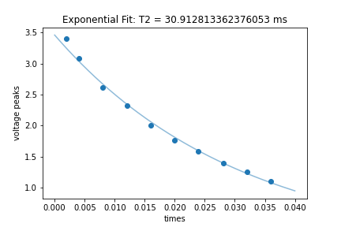

# Pulsed NMR Lab - Lab Notes

## Preliminary exploration
Following instructions from setup 8.1 Single Pulse
with the settings dictated in the lab manual
- set the sweep rate (horizontal width) slightly higher to ~40us so that the decay is more prominent

#### Effect of changing A-width
as we change A-width from low to high, the height of the decay curve rises, also the wave pulses. However this may due to some noise with the measurement devices. Effectively, A width sets the length of the pulse that is applied. We can change the width to determine essentially the angle of rotation that is applied to the magnetic moment, and use the width to determine the π and π/2 pulses. 

Setting the scope to MAN and pressing the MAN Start button, the measurement curve pulses up and down but not a lot of change is observed.

Changing the scope's sweep rate to 1ms/cm and repitition time to 10ms. When the variable repittion time is at 100%, only one decay curve is observed. As the variable repitition time is decreased down to 10%, the width of measurement for the signal is decreased, and we see the signal being repeated on the oscilloscope, up to 9 times. 

## Toggling with the controls
Turning on both an A and a B pulse, we observe the same pattern that is seen in Figure 7 in [the lab manual](nmr.pdf).
The signal from channel A shows 2 spikes at each pulse from channel B. The signal then decays.

Increasing A width increases the height of the channel A signal, at the location of both pulses. It also pulses the amplitude of the signal at both pulse locations.
Increasing B width does not affect the height of the signal at pulse A, and only increases the height of the signal at B. The pulsing of the signals is likely due to noise in the aparatus.

Essentially, changing pulse width A affects the whole signal and changing pulse width B only affects the signal after pulse A. 

In theory, pulse B should have no effect on pulse A.
However, probably due to the interference, there are small changes to the signal at A when the pulse width B is changed

## Setting up the oscilloscope
After a **very** long time (over 2 labs) of toggling with the controls, finally figured out the settings on the oscilloscope to obtained a plot similar to Figure 8.

Note to set these parameters
- CW-RF turning on
- blanking turned on

Everything else should be exactly as described in the lab manual, not sure why the behaviour on the apparatus was so wonky. 

Also connected the outputs to both scopes, with the magnetization envelopes measured in the main scope connected to labview, and the outputs of the pulses connected to other scope to see the π and π/2 pulses being applied
## Tuning to resonant frequency
Looking at the measurements of the magnetic field in the oscilloscope, adjusted the frequency until no osciallations were observed. This corresponds to a frequnecy of 15.32939MHz

## π/2 pulse
Next, found the A width needed for a π/2 pulse, which means the entire magnetic field gets rotated into the xy plane for measurement. This corresponds to 5.64 us, which is around the 20% mark on the knob. 
Data from scope is saved at: **max_envelope_aw=5-64.dat**

## π pulse
For a π pulse, the magnetization will be flipped exactly into the negative z axis, and corresponds to minimum measured magnetic field. The width for this was determined as 12.16 us, corresponding to a knob level of around 40%. 
The data from scope saved as **min_envelope_aw=12-16us.dat**

# Understanding of the theory of the experiement

After discussions with the lab TA and thoroughly reading through the lab manual a few more times, I think I have gained a better understanding of the underlying physics of this experiment.

This experiment will seek to measure the T1 and T2 decay constants for the pulsed nuclear magnetic resonance.

A sample of mineral oil is suspended inside a powerful magnetic field, which is oriented in the z direction. The spins of the molecules inside the sample are aligned by this external magnetic field in the z direction. 

Our apparatus can measure the magnetic field experienced in the xy plane and so we displace the spins into this plane for measurement. We can apply an external pulse which will flip the spins by some angle. A π pulse rotates the spins by 180 degrees, effectively reversing their direction. A π/2 pulse rotates the spins by 90 degrees, which will project a z spin into the xy plane for measurement. 

In the z axis, if the spin of the molecules are flipped 180 degrees, they will tend to decay back to align with the original field. We can think of this as the vector decaying from -z to +z. The decay can be described by a time constant T1, where the spins will re-orient themselves proportional to to exp(-t/T1). This is the first T1 time constant that we wish to measure. 

When the spins originate in the xy plane, we expect a similar decay process. However, due to inhomeneities in the magnetic field, when the spins are projected onto the xy plane, they will precesses at different speeds and "dephase". 

If there were no de-phasing of the spins, then we would be simply able to measure the decay of the magnetic field in the xy plane through applying a π pulse. However, as soon as the spins are flipped into the xy-plane, the dephasing causes us to quickly lose the ability to measure the magnitude of the magnetization (essentially our device measures the "average" spin for a collection of states. If the spins are oriented all over the place, the "average" is basically 0). However, if we now apply a π pulse to flip the spins in the xy plane, the spins begin to experience the exact same fields, but in the reverse direction. This causes the dephasing effect to be reversed and the phases precess back until the spins become measureable again (this is when we see the "echo" peak). This is the kindergarders example which was described in the lab manual. During this entire process, the magnetization continues to decay with some time constant, which is T2, and so by curve fitting the echo peaks, we can calculate this time constant. 

Thus we can calculate T2 as the time constant for decay in the xy plane, in proportion to exp(-t/T2)

# Nov 24
## Calculation of T1

Apply a π pulse at the A wave, to first flip the spins to the negative z axis. They now begin to decay back to +z. After some delay time, apply the 
π/2 pulse with the B wave so they spins are casted into the xy plane for measurement. Repeat for different delay times and fit for T1.

The analysis is performed in [calculate_T1.ipynb](calculate_T1.ipynb)

# Calculation of T2
Apply a π/2 pulse at the A wave, to flip the spins to the xy plane. They now begin to decay in magnitude but also precess at differnt speeds. After some delay time, apply the π pulse with the B wave so they spins are flipped in the xy plane and reverse their precessions. We measure the magnitude of the echo and repeat at different delay times and fit for T2.

The analysis is performed in [calculate_T2.ipynb](calculate_T2.ipynb)

# Dec 01 - retaking the data and more analysis

## T1
We find that the zero crossing point for T1 is approximately 16ms by varying the delay of π/2 pulse. 

For T1, first make sure the A pulse is a π pulse, this means that the envelope should be zero. This is achieved when the A width is set to around 38%

Next check that B pulse is a π/2 pulse. This is done by turning off A and tuning the width of B so that we see the maximum envelope. This is achieved with a B-width of around 15%.

Next check the magnitude of T1. We know that the response should decay at a rate of exp(-t/T1). Both A and B pulses are turned on. we notice that the magnitude of the envelope decreases as the delay time increases, which makes snese becuase we are fliping the magnetic moment into the xy plane for measurement after that delay time. We can clearly see the second peak corresponding to the measurement when this happens. Values for the delay time are tested, and it appears that at aroudn 18ms, the curve is almost nearly zero. Therefore will take a series of measurements in increments of 2ms up until 18ms to fit the curve for T1. Channel 2 is not needed so we only collect the data from channel 1 on the scope. 
We can't set the delay time to zero, so for the first measurement use a delay time of 100ns. Then measure at 2ms, 4ms, ..., all the way up to 18ms

Analysis is done in [calculate_T1_again.ipynb](calculate_T1_again.ipynb)

# T2

For T2, we first check that A is a π/2 pulse and B is a π pulse. Turn off B pulse and check that A width gives a maximum envelope, aroudn 17% A width. Next turn off A, turn on B, and tune B-width so that the magnitude of the envelope is minimum. This corresponds to a B-width of aroudn 38%.

Analysis is done in [calculate_T2_again.ipynb](calculate_T2_again.ipynb)

# Results

From the two sets of experiments performed, the two values for T1 were fairly close, around the 10ms. To find an exact experimental estimate of T1, we average the two experiments to obtain an estimate for 

### T1 = (11.266 + 9.137) / 2 = 10.2 ms

The two experiments for T2 saw large devations in the end results, if we take the average, we obtain an estimate for

### T2 = (20.828 + 30.913) / 2 = 25.9 ms

# Concluding Remarks

Overall, in this lab, we measured the decay constants in along the z axis and in the xy plane for a collection of spins in a mineral oil sample. We saw fairly close values for determining T1 from 2 experiments and a larger deviation for the calculation of T2. Given more time, the experiment for T2 should be repeated, with more data points collected and at a greater resolution. Since the oscilloscope did exhibit a good level of noise, taking multiple data points at the same location and averaging will also yield more accurate results. 

Overall, it was very interesting to learn about the dephasing phenomena of the magnetic spins and to observe it experimentally with the spin-echo technique. 

